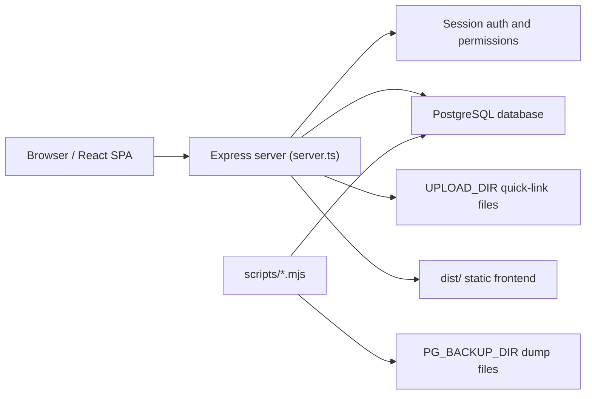

# UGC IT Service Request System Documentation

This folder documents the codebase, database, workflows, and production operations for the UGC IT Service Request System.

## Start Here

- [Architecture](./ARCHITECTURE.md): application shape, runtime flow, frontend/backend boundaries, and key modules.
- [Business Workflows](./WORKFLOWS.md): how requests move through employee, divisional head, desk officer, service provider, and admin actions.
- [Database](./DATABASE.md): PostgreSQL schema, table purpose, relationships, indexes, and JSON fields.
- [API Reference](./API.md): Express routes, permissions, and major request/response behavior.
- [Operations](./OPERATIONS.md): production setup, environment variables, migrations, backups, restore, release, and monitoring checks.

## Current Production Readiness Baseline

The application is a single React/Vite frontend served by an Express server. Production uses PostgreSQL. SQLite support remains for local development and migration compatibility.

Verified locally:

- TypeScript check passes with `npm.cmd run lint`.
- Production build passes with `npm.cmd run build`.
- Production preflight passes with `npm.cmd run prod:preflight`.
- PostgreSQL backup works with `npm.cmd run pg:backup`.
- Production server starts with `npm.cmd start` and `/healthz` returns `200`.

## High-Level System Diagram

## Documentation Maintenance Rule

When changing business workflow, database schema, API contracts, deployment scripts, permissions, or production behavior, update the matching document in this folder in the same change.
