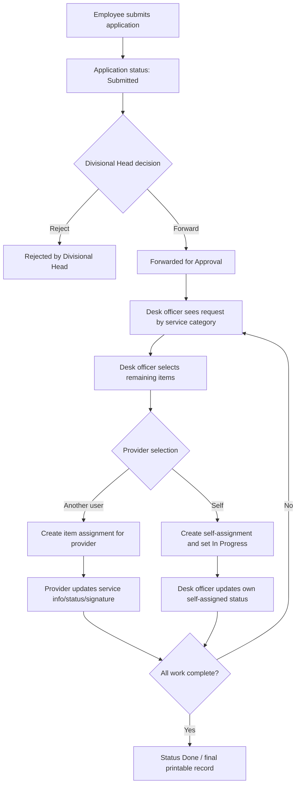

# Business Workflows

## Statuses

| Status | Meaning |
| --- | --- |
| `Submitted` | Employee submitted the request; divisional head has not forwarded it yet. |
| `Forwarded for Approval` | Divisional head approved/forwarded, or desk officer sent items to a provider. |
| `In Progress` | Work has started, including desk-officer self-assignment. |
| `Presented in File` | Provider/desk officer has presented the matter in file. |
| `Done` | Service work is complete. |
| `Rejected by Divisional Head` | Divisional head rejected the submitted request. |

## End-To-End Request Flow

## Employee Flow

1. Employee logs in.
2. Employee opens application form.
3. Employee selects one or more service categories/items.
4. Employee adds problem details and applicant signature.
5. Server creates an application with `status = Submitted`, generated `tracking_no`, applicant metadata, and category problem details.
6. Employee can view own application history.

Tracking numbers are generated by division, year, month, and serial. PostgreSQL uses `application_tracking_counters` to avoid duplicate serials.

## Divisional Head Flow

1. Divisional head sees submitted applications for their division.
2. They approve/forward or reject.
3. Approval writes `div_head_email`, `div_head_signature`, `div_head_signed_at`, and status.
4. Rejected applications move to the rejected workflow.

Authorization rule: divisional heads can act only on their own division unless they have broad/admin access.

## Desk Officer Flow

Desk officers own categories such as hardware, network, software, or maintenance.

1. Desk officer opens assigned applications.
2. The app determines relevant items from `service_type`.
3. Existing item assignments are read from `application_item_assignments`.
4. Remaining unassigned items are shown for selection.
5. Desk officer selects items and chooses a provider from the dropdown.
6. Server inserts one row per selected item into `application_item_assignments`.

Important rules:

- Desk officers keep the `Send` flow while there are remaining unassigned items.
- Once there are no remaining items and the desk officer has self-assigned items, they get the status-update flow for the self-assigned work.

## Service Provider Flow

Service provider access is feature-based, not role-based.

1. Admin gives a user one or more provider features.
2. The user sees assigned applications where `application_item_assignments.provider_email` matches their email.
3. Provider updates service information, status, signature, and signed timestamp.
4. Server updates all rows for that application/officer role/provider email.

Provider features:

- `service_provider_hardware`
- `service_provider_network`
- `service_provider_software`
- `service_provider_maintenance`

## Desk Officer Self-Assignment

Self-assignment is a controlled exception.

When a desk officer selects themselves from the provider dropdown:

1. Server stores the desk officer as provider for selected items.
2. Assignment status becomes `In Progress`.
3. Provider designation is populated from the provider feature label if user designation is missing.
4. The desk officer does not need a separate service-provider feature for this self-assigned work.
5. After all remaining items are assigned, the desk officer can update status for their own self-assigned items without selecting a provider again.

## Multiple Provider Assignment

One application can have multiple items assigned to different providers.

| Item | Provider |
| --- | --- |
| Printer/Toner | Desk officer self-assigned |
| Monitor | ICT staff with hardware provider feature |

Each item is stored as an assignment row. The unique constraint prevents assigning the same item twice for the same application and officer role.

## User And Permission Management

Recommended model:

- Primary role defines the user's main identity/work queue.
- Extra features define additional capabilities.

Primary roles should include `admin`, `employee`, `divisional_head`, and `desk_officer_*`.

Service provider capability should be assigned as an extra feature, not as a primary role. The UI removes `service_provider_*` from primary role selection. Existing legacy provider-role users are converted in the edit form to `employee` plus the matching `service_provider_*` feature.

## Signature Approval Flow

1. User uploads or changes signature from profile.
2. If a signature already exists, the new one is stored as `pending_signature`.
3. Admin reviews signature approval requests.
4. Admin approval moves pending signature into active `signature`.
5. Admin rejection clears pending signature.

## Print/PDF Flow

When printing:

- Provider selection controls are hidden.
- Status update controls are hidden.
- Printable application details, assigned item blocks, provider service information, signatures, and status text remain visible.

## Audit Logging

Mutating API requests are logged to `audit_logs`.

Logged fields include user email/name/role, action, method, path, status code, duration, and IP metadata.
