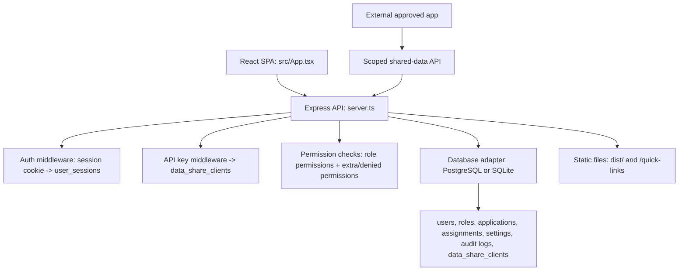
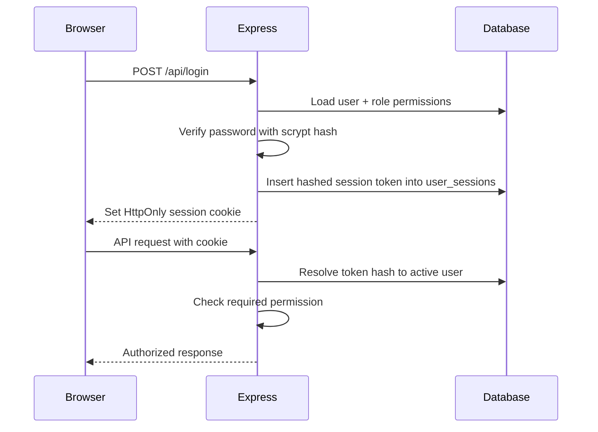
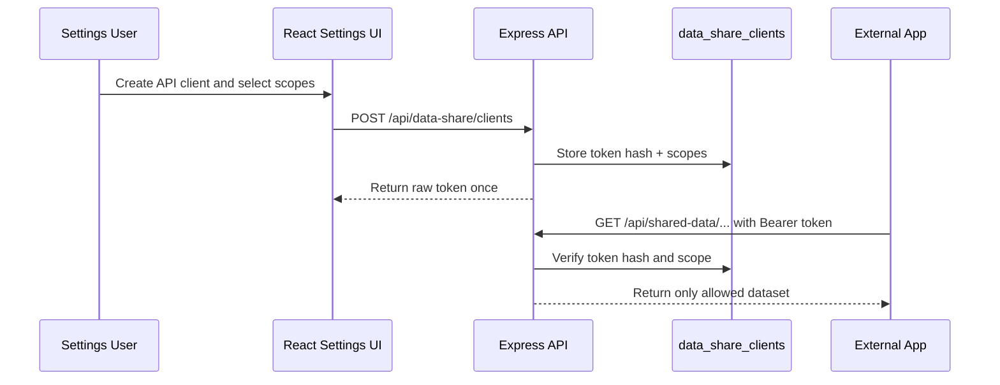
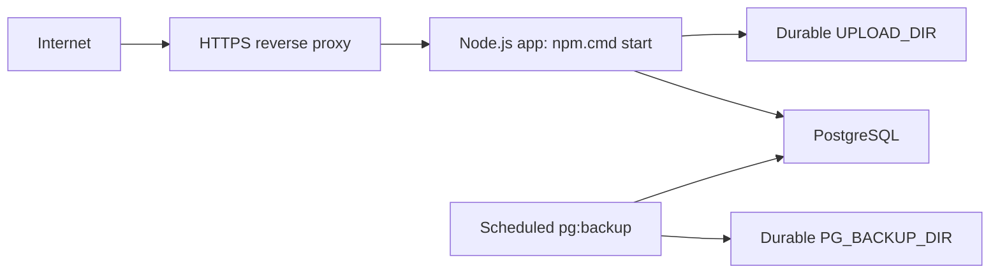

# Architecture

## Purpose

The system manages UGC IT service requests from submission to approval, desk-officer assignment, service-provider execution, reporting, and audit logging.

Primary users:

- Employee: submits IT service requests and tracks own applications.
- Divisional Head: receives division applications and approves/forwards them.
- Desk Officer: receives approved requests by service category and assigns selected items to providers.
- Service Provider: receives assigned items and updates service progress/status.
- Admin: manages users, roles, divisions, settings, signatures, reports, and audit logs.

## Runtime Structure



## Main Files

| Path | Responsibility |
| --- | --- |
| `src/App.tsx` | React application, state routing, screens, forms, workflow UI, print views, reports, settings. |
| `server.ts` | Express server, auth, permissions, APIs, database adapter, seeding, security headers, static serving. |
| `migrations/*.sql` | PostgreSQL schema migrations. |
| `scripts/db-migrate-postgres.mjs` | Applies PostgreSQL migrations. |
| `scripts/prod-preflight.mjs` | Production readiness checks for env, DB, migrations, backups, and writable paths. |
| `scripts/pg-backup.mjs` | Creates PostgreSQL custom-format dumps. |
| `scripts/pg-restore.mjs` | Restores PostgreSQL dumps with explicit confirmation. |
| `deploy/PRODUCTION_RUNBOOK.md` | Production deployment and restore runbook. |

## Frontend Structure

The frontend is currently concentrated in `src/App.tsx`. It includes shared constants, settings helpers, workflow helpers, modal components, dashboards, lists, profile, reports, and admin screens.

Major screen components:

- `ApplicationForm`
- `AdminDashboard`
- `ReceivedApplications`
- `ForwardedApplications`
- `RejectedApplications`
- `EmployeeDashboard`
- `TelephoneDirectoryPage`
- `ApplicationViewModal`
- `ApplicationList`
- `PasswordChangeRequired`
- `AuditLogBook`
- `SignatureApprovalPanel`
- `Profile`
- `UserManagement`
- `ReportsPage`
- `AllApplications`
- `SystemSettings`
- `DivisionManagement`
- `RoleManagement`
- `UserReport`

## Backend Structure

`server.ts` has these major sections:

- Environment loading and production configuration validation.
- Tracking number generation.
- Database connection and adapter compatibility for PostgreSQL/SQLite.
- Password hashing and verification with `crypto.scrypt`.
- Default system settings and role/category helpers.
- Assignment normalization helpers.
- Session token creation, hashing, lookup, and deletion.
- Seed data and local SQLite migrations.
- Express middleware: security headers, JSON parsing, static uploads, auth, maintenance mode, audit logging.
- Route handlers for auth, roles, users, applications, settings, directory, reports, signatures, and health.
- Scoped read-only data sharing API for approved external apps.
- Vite dev middleware in development and `dist/` static serving in production.

## Auth And Permission Model

Authentication uses a database-backed session cookie.



Effective permissions are calculated from role permissions, `extra_permissions`, and `denied_permissions`.

```text
effective_permissions = role.permissions + extra_permissions - denied_permissions
```

Service provider access is feature-based:

- `service_provider_hardware`
- `service_provider_network`
- `service_provider_software`
- `service_provider_maintenance`

These features grant assigned-work access without making service provider a primary role. Legacy `service_provider_*` primary roles are still tolerated by backend logic, but the user-management UI treats provider capability as a feature.

## Controlled Data Sharing

External systems should not connect directly to the database. Admin/settings users create named API clients from System Settings and choose exactly which data scopes are exposed.



Current scopes are `applications`, `assignments`, `telephone_directory`, and `divisions`. Shared endpoints are read-only and exclude passwords, sessions, signatures, and internal audit details.

## Service Category Mapping

| Desk officer role | Provider feature | Category |
| --- | --- | --- |
| `desk_officer_hardware` | `service_provider_hardware` | Hardware |
| `desk_officer_network` | `service_provider_network` | Network |
| `desk_officer_software` | `service_provider_software` | Software |
| `desk_officer_maintenance` | `service_provider_maintenance` | System maintenance |

The mapping is generated from managed categories in system settings, so category labels and officer roles can be adjusted through settings when needed.

## Printing/PDF Behavior

`ApplicationViewModal` renders printable application content and interactive workflow controls. Print behavior:

- Status update panel is excluded by `no-print print:hidden`.
- Provider-selection controls are excluded by `no-print print:hidden`.
- Print/PDF views show records, assignments, service information, signatures, and status text, not action controls.

## Deployment Shape



Production should use PostgreSQL only. SQLite is for local testing and migration support.
