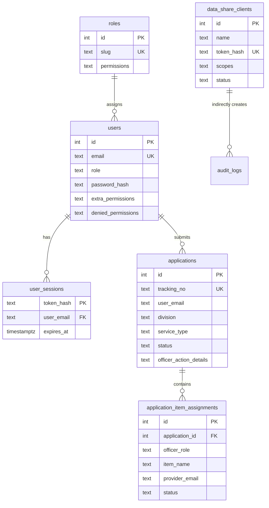

# Database Documentation

Production database: PostgreSQL.

Local development can use SQLite, but production should use PostgreSQL with migrations in `migrations/*.sql`.

## Entity Relationship Diagram



## Migrations

| Migration | Purpose |
| --- | --- |
| `001_initial_postgres.sql` | Core tables: users, divisions, roles, applications, system settings, telephone directory, audit logs, indexes. |
| `002_user_sessions.sql` | Database-backed login sessions. |
| `003_assignment_normalization_and_tracking.sql` | Tracking counters and normalized item assignments. |
| `004_data_share_clients.sql` | Scoped external API clients with hashed tokens. |
| `005_data_share_access_logs.sql` | Push/pull activity logs for controlled API sharing. |

Run migrations:

```powershell
npm.cmd run db:migrate:pg
```

## Tables

### `users`

Stores application users.

| Column | Purpose |
| --- | --- |
| `email` | Login identifier; unique. |
| `password_hash` | Scrypt password hash. |
| `password` | Managed placeholder or legacy password compatibility field. |
| `role` | Primary role slug. |
| `extra_permissions` | JSON string array of user-specific added features. |
| `denied_permissions` | JSON string array of removed permissions. |
| `signature` | Active signature data/path. |
| `pending_signature` | Signature awaiting admin approval. |
| `must_change_password` | Forces password change after admin reset/create. |

Permission calculation:

```text
effective_permissions = role.permissions + extra_permissions - denied_permissions
```

Provider features in `extra_permissions` also grant `assigned_applications`.

### `roles`

Stores primary roles and their default permissions.

| Column | Purpose |
| --- | --- |
| `slug` | Stable role identifier used by code. |
| `permissions` | JSON string array of feature IDs. |
| `status` | Active/inactive state. |

Service provider slugs may exist for legacy compatibility but should not be assigned as primary roles for new users.

### `applications`

Stores the main service request record.

| Column | Purpose |
| --- | --- |
| `tracking_no` | Human-facing unique tracking number. |
| `user_email`, `user_name` | Applicant identity snapshot. |
| `division` | Applicant division. |
| `service_type` | Selected service category/item string. |
| `problem_details` | General problem text. |
| `category_problem_details` | JSON string keyed by category. |
| `status` | Overall application status. |
| `div_head_*` | Divisional head approval metadata. |
| `officer_action_details` | JSON string cache of officer/provider actions and assignments. |

`officer_action_details` remains for display compatibility, but normalized item assignment data lives in `application_item_assignments`.

### `application_item_assignments`

Stores one assigned item per row.

| Column | Purpose |
| --- | --- |
| `application_id` | Parent application. |
| `officer_role` | Desk officer category role, for example `desk_officer_hardware`. |
| `item_name` | Selected item assigned to a provider. |
| `provider_email` | User assigned to perform the service. |
| `provider_role` | Provider feature/legacy provider role. |
| `desk_officer_name` | Desk officer who assigned the item. |
| `desk_signature`, `desk_signed_at` | Desk officer assignment signature/date. |
| `status` | Item/provider status. |
| `officer_service_info` | Provider service notes. |
| `provider_signature`, `provider_signed_at` | Provider completion/update signature/date. |

Constraint:

```sql
UNIQUE (application_id, officer_role, item_name)
```

This prevents the same item being assigned twice in the same officer category.

### `application_tracking_counters`

Controls tracking serial generation in PostgreSQL.

Primary key:

```sql
(division, year, month)
```

The counter is incremented atomically with `ON CONFLICT ... DO UPDATE`.

### `user_sessions`

Stores hashed session tokens.

| Column | Purpose |
| --- | --- |
| `token_hash` | SHA-256 hash of browser session token. |
| `user_email` | Session owner. |
| `expires_at` | Session expiry. |
| `last_seen_at` | Last request timestamp. |

The raw session token is only sent to the browser as an `HttpOnly` cookie.

### `system_settings`

Key/value store for application configuration.

Main key:

```text
app_system_settings
```

The value is a JSON document containing branding, managed categories, request types, quick links, maintenance mode, daily quote settings, and other UI/system behavior.

### `telephone_directory_entries`

Stores telephone directory contacts used by the directory screen, import scripts, and admin settings flows.

### `audit_logs`

Stores audit records for mutations and auth activity.

| Column | Purpose |
| --- | --- |
| `created_at` | Timestamp. |
| `user_email`, `user_name`, `user_role` | Acting user snapshot. |
| `action`, `method`, `path` | What happened. |
| `status_code` | Response status. |
| `details` | JSON metadata such as duration and IP. |

### `divisions`

Stores organization divisions used by user assignment, application submission, filtering, and reporting.

### `data_share_clients`

Stores controlled external API clients.

| Column | Purpose |
| --- | --- |
| `name` | Human-readable external app/client name. |
| `token_hash` | SHA-256 hash of the generated API token. The raw token is shown once only. |
| `scopes` | JSON string array of allowed data scopes. |
| `status` | `Active` or `Revoked`. |
| `created_by` | Admin/settings user who created the client. |
| `last_used_at` | Last successful scoped API request. |
| `revoked_at` | Revocation timestamp. |

Available scopes:

- `applications`
- `assignments`
- `telephone_directory`
- `divisions`

### `data_share_access_logs`

Stores activity visible from the API Settings menu.

| Column | Purpose |
| --- | --- |
| `client_id`, `client_name` | API client that performed or was affected by the action. |
| `direction` | `Pull` for external data reads, `Push` for API settings/admin changes. |
| `scope` | Data scope, such as `applications`, `assignments`, `divisions`, `telephone_directory`, or `meta`. |
| `endpoint`, `method`, `status_code` | API route and result metadata. |
| `row_count` | Number of records/endpoints returned or affected. |
| `ip`, `user_agent` | Request origin metadata. |
| `details` | JSON details such as filters or admin action. |
| `created_at` | Log timestamp. |

## Important Indexes

| Index | Purpose |
| --- | --- |
| `idx_users_email` | Login/session lookup. |
| `idx_users_role` | Role-based user lookup. |
| `idx_applications_user_email` | Applicant history. |
| `idx_applications_status` | Status filtering. |
| `idx_applications_division` | Divisional head workflow and reports. |
| `idx_assignment_provider_email` | Provider assigned applications. |
| `idx_assignment_application_id` | Load assignments for an application. |
| `idx_assignment_officer_role` | Desk officer category filtering. |
| `idx_assignment_status` | Status reports. |
| `idx_user_sessions_expires_at` | Session cleanup. |

## JSON Columns

| Column | Expected shape |
| --- | --- |
| `roles.permissions` | `string[]` |
| `users.extra_permissions` | `string[]` |
| `users.denied_permissions` | `string[]` |
| `applications.category_problem_details` | `{ [category: string]: string }` |
| `applications.officer_action_details` | `{ [deskOfficerRole: string]: roleDetails }` |
| `system_settings.value` | Settings object |
| `audit_logs.details` | Metadata object |
| `data_share_clients.scopes` | `string[]` |

## Backup And Restore

Create backup:

```powershell
npm.cmd run pg:backup
```

Restore:

```powershell
$env:CONFIRM_PG_RESTORE="YES"
npm.cmd run pg:restore -- C:\path\to\backup.dump
```

`PG_BACKUP_DIR` must be outside the application folder in production.
